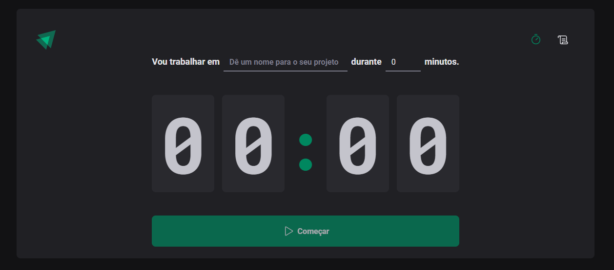

<h1 align="center">Pomodoro Timer ⏱️</h1>

  

 
<h2>⏳ Sobre</h2>

Aplicação web para ajudar as pessoas a terem um foco maior na realização de suas atividades diárias. Ele consiste no usuário informar qual o nome da atividade (estudar, escrever um artigo, fazer o trabalho da escola, etc.), e quantos minutos ele pretende ceder para concluir a mesma. Após isso, o contador será inicializado, e é possível interromper o mesmo, caso ocorra algum imprevisto durante a execução da atividade. Além disso, a aplicação possui uma página para guardar o histórico das atividades que o usuário iniciou, informando qual foi essa atividade, quando ela foi criada, quantos minutos o usuário escolheu, e seu status: Andamento, Interrompida ou Concluida. 

 
<h2>🎯 Objetivo</h2>

Entender a teoria e aplicar na prática alguns recursos do React que resolvem problemas específicos da própria biblioteca. O primeiro deles foi o conceito de Context API, que visa compartilhar dados entre componentes de uma maneira mais objetiva, reduzindo o Prop Drilling (passar dados via props para componentes que estão em diferentes camadas na árvore de componentes do React, dificultando a visualização e manutenção do código). Outro ponto foi utilizar a biblioteca React Hook Form em conjunto com o zod, para construir e validar os campos do formulário de uma maneira mais performática, sem precisar renderizar o componente toda vez que um caractere é inserido em um campo. Além disso, vimos o hook useReducer, que tem como objetivo trabalhar com estados complexos (armazenar um estado que possui diversas propriedades e métodos) de uma maneira melhor em comparação com o hook useState, entre outros benefícios.

 
<h2>🛠️ Tecnologias e ferramentas/bibliotecas utilizadas</h2>
<ul>
  <li><a href="https://pt-br.reactjs.org/">React</a></li>
  <li><a href="https://www.typescriptlang.org/">Typescript</a></li>
  <li><a href="https://styled-components.com/">Styled-Components</a></li>
  <li><a href="https://react-hook-form.com/">React Hook Form</a></li>
  <li><a href="https://github.com/colinhacks/zod">zod</a></li>
  <li><a href="https://date-fns.org/">date-fns</a></li>
  <li><a href="https://immerjs.github.io/immer/">immer</a></li>
</ul>
 
<h2>📌 Funcionalidades a serem implementadas</h2>
<ul>
  <li>Aplicar responsividade no layout para dispositivos móveis - Ok ✔️</li>
  <li>Incluir funcionalidade para pausar e retomar o tempo de um projeto - Ok ✔️</li>
</ul>
 
<h2>🔖 Layout</h2>

Você pode visualizar o layout do projeto através deste link: <a href="https://www.figma.com/file/EI9KjhywBjXgnDmNx0pGlR/Ignite-Timer-(Community)?node-id=0%3A1">Layout do projeto</a>. É necessário possuir uma conta no <a href="https://figma.com">Figma</a> para acessá-lo.

 
 

Made by Matheus Pazinati 🛸
